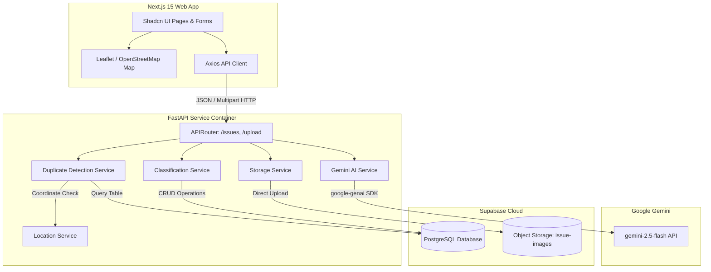
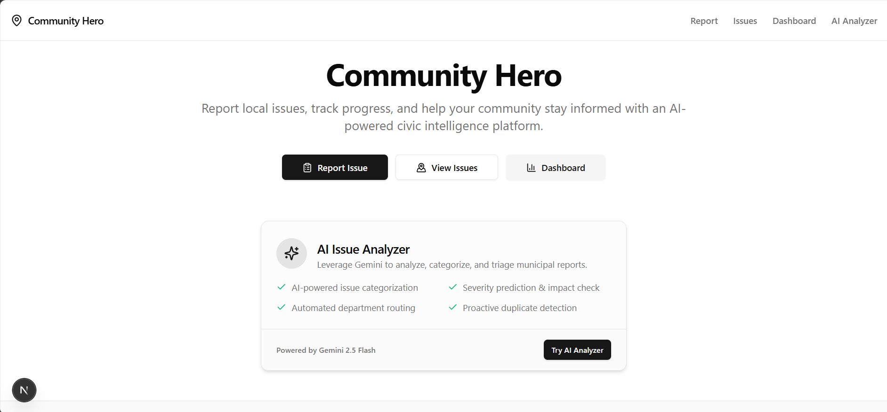
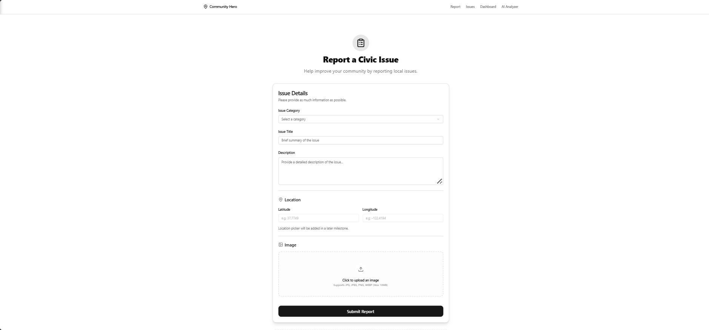
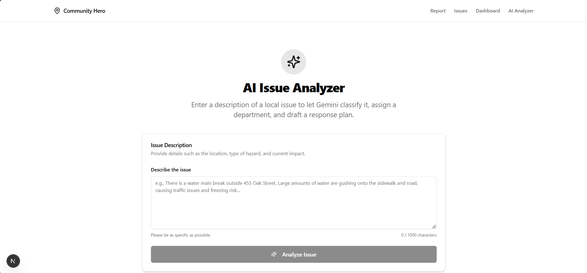
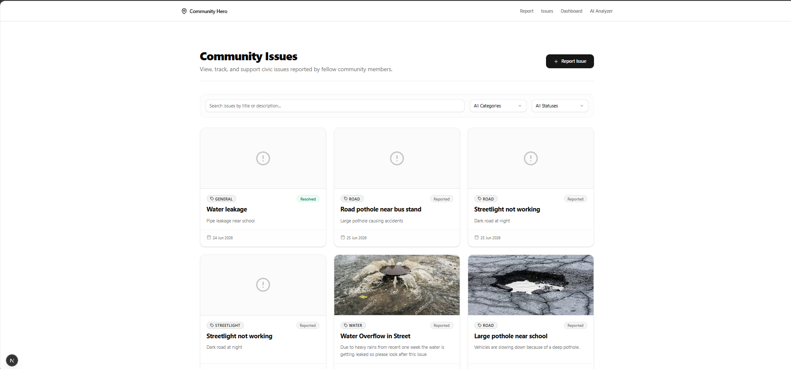
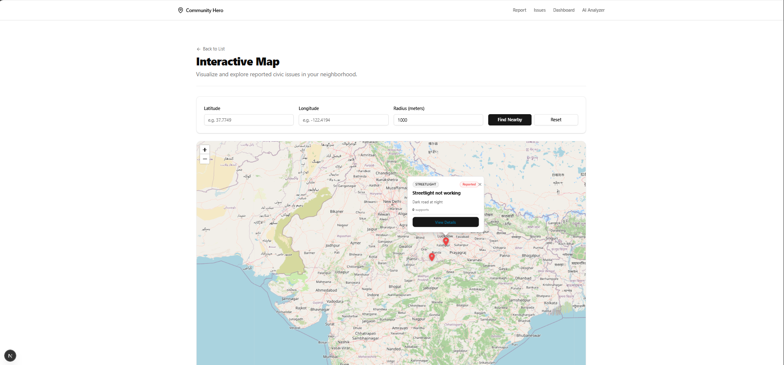
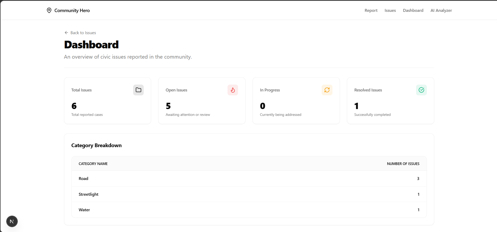
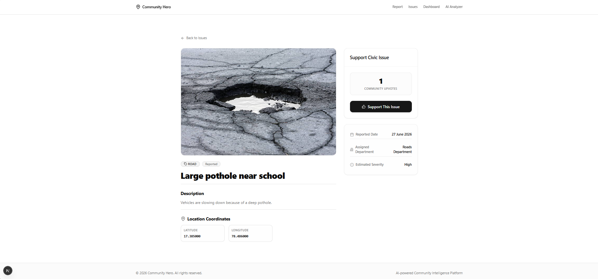

# 🦸‍♂️ Community Hero: AI-Powered Hyperlocal Problem Solver

[](https://nextjs.org/)
[](https://fastapi.tiangolo.com/)
[](https://supabase.com/)
[](https://deepmind.google/technologies/gemini/)
[](https://www.typescriptlang.org/)
[](https://tailwindcss.com/)
[](https://opensource.org/licenses/MIT)

Community Hero is an AI-powered civic issue management platform that empowers citizens to report, track, and support local community issues (such as potholes, water leaks, broken streetlights, and waste management hazards). 

By integrating **Google Gemini AI** and **Supabase Space/Postgres**, the platform intelligently summarizes reports, assesses public safety impact, predicts severity, routes issues to the responsible municipal department, and actively intercepts duplicate reports in real-time before they clutter the database.

---

## 📖 Table of Contents

- [🦸‍♂️ Community Hero: AI-Powered Hyperlocal Problem Solver](#-community-hero-ai-powered-hyperlocal-problem-solver)
  - [📖 Table of Contents](#-table-of-contents)
  - [🎯 Problem Statement](#-problem-statement)
  - [💡 Solution Overview](#-solution-overview)
  - [🛠️ Key Features](#️-key-features)
  - [🤖 AI Workflow (Gemini 2.5 Flash)](#-ai-workflow-gemini-25-flash)
  - [💻 Tech Stack](#-tech-stack)
  - [🏗️ System Architecture](#️-system-architecture)
  - [📂 Folder Structure](#-folder-structure)
  - [⚙️ Environment Variables](#️-environment-variables)
  - [🚀 Installation \& Setup](#-installation--setup)
    - [Prerequisites](#prerequisites)
    - [1. Clone the Repository](#1-clone-the-repository)
    - [2. Backend Setup (FastAPI)](#2-backend-setup-fastapi)
    - [3. Frontend Setup (Next.js 15)](#3-frontend-setup-nextjs-15)
  - [🔌 API Overview](#-api-overview)
    - [Issues Router (`/issues`)](#issues-router-issues)
    - [Upload Router (`/upload`)](#upload-router-upload)
  - [🖼️ Interface \& Screenshots](#️-interface--screenshots)
  - [🔮 Future Enhancements](#-future-enhancements)
  - [🌟 Why This Solution Stands Out](#-why-this-solution-stands-out)
  - [🌐 Google Technologies Used](#-google-technologies-used)
  - [📄 License](#-license)
  - [👥 Authors](#-authors)

---

## 🎯 Problem Statement

Traditional civic report management systems suffer from severe friction points that drag down local administrations:
1. **High Triage Overhead**: Municipal staff manually review, categorize, and assign incoming civic complaints (e.g., potholes, leaks, broken lights).
2. **Duplicate Noise**: Several citizens frequently file separate complaints for the same visible issue (e.g., a major pothole on a busy highway), bloating the database and splitting resolution focus.
3. **Ambiguous Descriptions**: Citizen reports often lack actionable technical summaries, making it difficult for city crews to evaluate public safety impact.
4. **Lack of Transparency**: Citizens submit tickets into a "black box" without clean visibility into which department received it, when status changes, or its resolution timeline.

---

## 💡 Solution Overview

Community Hero bridges the gap between community complaints and rapid government execution by adding a smart AI intelligence layer to reporting:
* **Pre-emptive Duplicate Interception**: When a user goes to submit a report, the backend checks for existing issues of the same category within a 100-meter radius. If a duplicate is found, the user is encouraged to support/upvote the existing issue instead of creating a new one.
* **Instant AI Classification**: The platform parses user descriptions in real-time, matching keywords to categories, predicting severity levels, and routing issues directly to the appropriate department.
* **AI Report Generation**: Integrates the new `google-genai` SDK and `gemini-2.5-flash` model to analyze reported complaints and output a structured response plan containing a concise issue summary, estimated public impact, and recommended action steps.
* **Interactive Civic Mapping**: Citizens can explore an open interactive map highlighting issues around their location, see color-coded markers based on execution status, and view status progression.

---

## 🛠️ Key Features

| Feature | Description | Implemented Details | Status |
| :--- | :--- | :--- | :--- |
| 🤖 **AI Issue Analysis** | Generates structured reports using Gemini 2.5 Flash. | Extract summaries, public safety impact, and action plans. | Implemented |
| 🔀 **Department Routing** | Auto-predicts target department based on description. | Routes to Roads, Water, Electrical, Sanitation, or General. | Implemented |
| ⚠️ **Severity Prediction** | Assesses and assigns severity labels. | High, Medium, or Low severity based on hazard type. | Implemented |
| 📍 **Interactive Maps** | Dynamic geospatial mapping of civic complaints. | Interactive OpenStreetMap/Leaflet integration. | Implemented |
| 🔍 **Geospatial Duplicate Check** | Automatically checks for identical nearby issues. | Intercepts issues within a 100m radius of the same category. | Implemented |
| 🗳️ **Community Support** | Allows citizens to upvote/support existing local issues. | Increments a support/upvote count to highlight priorities. | Implemented |
| 📊 **Municipal Dashboard** | Metrics on overall reporting and issue status. | Summarizes Total, Reported, In Progress, and Resolved. | Implemented |
| 📁 **Image Storage** | Citizens upload photos of issues directly from the form. | Secure file uploads into Supabase Storage bucket. | Implemented |
| 📜 **Audit History** | Records status transitions for complete transparency. | Tracks status changes (`Reported` -> `In Progress` -> `Resolved`). | Implemented |

---

## 🤖 AI Workflow (Gemini 2.5 Flash)

The system harnesses the power of **Google Gemini 2.5 Flash** to analyze reports in real-time:

```
[ User Input Description ]
           │
           ▼
[ FastAPI App Services ]
           │
           ├─► Keyword Classifier ──► (Categorizes: Water, Road, Streetlight, Waste)
           │                      ──► (Routes: Water, Roads, Electrical, Sanitation)
           │                      ──► (Estimates: High, Medium, Low Severity)
           │
           ├─► google-genai Client Call
           │    │
           │    ├─► Model: gemini-2.5-flash
           │    └─► Prompt: Structured summary + Public safety impact + Department suggestions
           │
           ▼
[ Clean JSON Response ] ──► Summary, Severity, Assigned Department, & Detailed AI Assessment Plan
```

---

## 💻 Tech Stack

### Frontend
* **Core Framework**: Next.js 15 (App Router)
* **Language**: TypeScript
* **Styling**: Tailwind CSS & CSS Variables
* **UI Component Library**: Shadcn UI (with Radix UI primitives)
* **Form Management**: React Hook Form
* **Validation Schema**: Zod
* **HTTP Client**: Axios
* **Interactive Maps**: Leaflet & React Leaflet (OSM tiles)
* **Icons**: Lucide React

### Backend
* **API Framework**: FastAPI (Python 3.11+)
* **Server**: Uvicorn
* **Database Driver**: Supabase Python client (postgrest-py)
* **Validation**: Pydantic v2
* **Environment Configuration**: Dotenv & Pydantic-settings

### Services & Infrastructure
* **AI Engine**: Google Gemini API via the `google-genai` SDK
* **Database**: Supabase PostgreSQL
* **Object Storage**: Supabase Storage (`issue-images` bucket)
* **Deployment Target**: Google Cloud Run (Backend) & Vercel (Frontend)

---

## 🏗️ System Architecture



---

## 📂 Folder Structure

```
community-hero/
├── backend/
│   ├── app/
│   │   ├── api/                   # FastAPI Endpoints
│   │   │   ├── issues.py          # /issues routes (reporting, filter, dashboard, status, support)
│   │   │   └── upload.py          # /upload routes (image uploads)
│   │   ├── config/
│   │   │   └── settings.py        # Settings loader using dotenv
│   │   ├── database/
│   │   │   └── supabase_client.py # Supabase client connection singleton
│   │   ├── schemas/               # Pydantic schemas (Request/Response validation models)
│   │   │   ├── dashboard_schema.py
│   │   │   ├── history_schema.py
│   │   │   ├── issue_schema.py
│   │   │   ├── status_schema.py
│   │   │   └── upload_schema.py
│   │   ├── services/              # Core business services
│   │   │   ├── classification_service.py # Category and severity prediction
│   │   │   ├── department_service.py     # Department issue filtering
│   │   │   ├── duplicate_detection_service.py # Geospatial duplicate detection
│   │   │   ├── gemini_service.py         # Google Gemini API client setup & prompt wrapper
│   │   │   ├── issue_service.py          # Issue CRUD logic
│   │   │   ├── location_service.py       # Distance calculations
│   │   │   └── storage_service.py        # Image uploading to Supabase
│   │   └── main.py                # FastAPI Application entry point
│   ├── .env.example               # Backend environment templates
│   └── requirements.txt           # Backend python packages
│
├── frontend/
│   ├── src/
│   │   ├── app/                   # Next.js 15 App Router
│   │   │   ├── ai/                # Standalone AI Issue Analyzer page
│   │   │   ├── dashboard/         # Municipal metrics and statistics dashboard
│   │   │   ├── issues/            # Lists all reported tickets with detail views
│   │   │   ├── map/               # Interactive fullscreen Leaflet Map
│   │   │   ├── report/            # Issue submission form with map picking & uploads
│   │   │   ├── layout.tsx
│   │   │   └── page.tsx           # Home landing page
│   │   ├── components/            # UI components
│   │   │   ├── common/
│   │   │   ├── issues/            # Issue lists and cards
│   │   │   ├── layout/            # Layout headers, footers
│   │   │   ├── map/               # Interactive map markers
│   │   │   └── ui/                # Shared custom Shadcn widgets
│   │   ├── services/              # Axios API clients
│   │   │   ├── api.ts             # Axios initialization
│   │   │   ├── issue.service.ts   # Issue API methods
│   │   │   └── upload.service.ts  # File upload API methods
│   │   ├── styles/
│   │   │   └── globals.css        # Base styling, Tailwind layers
│   │   └── types/                 # TypeScript interfaces
│   ├── .env.example               # Frontend environment template
│   ├── package.json               # Frontend dependencies
│   └── tailwind.config.ts         # Tailwind theme customizations
```

---

## ⚙️ Environment Variables

### Backend Configuration (`backend/.env`)
Create a `.env` file in the `backend/` folder:
```env
# Application Setup
APP_NAME="Community Hero API"
APP_ENV=development
DEBUG=true

# Server Config
HOST=0.0.0.0
PORT=8000

# CORS Configuration (allows frontend connection)
CORS_ORIGINS=http://localhost:3000

# Supabase Configurations
SUPABASE_URL=https://your-supabase-project-id.supabase.co
SUPABASE_ANON_KEY=your_supabase_anon_key
SUPABASE_SERVICE_ROLE_KEY=your_supabase_service_role_key

# Google AI Studio Gemini Config
GEMINI_API_KEY=AIzaSy...your_gemini_api_key
GEMINI_MODEL=gemini-2.5-flash
```

### Frontend Configuration (`frontend/.env.local`)
Create a `.env.local` file in the `frontend/` folder:
```env
# Backend API Location
NEXT_PUBLIC_API_URL=http://localhost:8000

# Supabase Credentials (optional on client if requests route through backend API)
NEXT_PUBLIC_SUPABASE_URL=https://your-supabase-project-id.supabase.co
NEXT_PUBLIC_SUPABASE_ANON_KEY=your_supabase_anon_key
```

---

## 🚀 Installation & Setup

### Prerequisites
* **Python**: 3.11 or higher
* **Node.js**: 18.x or higher
* **Supabase**: Access to a project database + Storage bucket named `issue-images`
* **Google Gemini API Key**: Acquired via Google AI Studio

---

### 1. Clone the Repository
```bash
git clone https://github.com/ganeshkds84/Hackathon-Community_Hero.git
cd Hackathon-Community_Hero
```

---

### 2. Backend Setup (FastAPI)
1. Navigate into the backend folder:
   ```bash
   cd backend
   ```
2. Create and activate a Python virtual environment:
   ```bash
   # Windows
   python -m venv .venv
   .venv\Scripts\activate

   # macOS / Linux
   python3 -m venv .venv
   source .venv/bin/activate
   ```
3. Install the dependencies:
   ```bash
   pip install -r requirements.txt
   ```
4. Copy the environment template and fill in your Supabase keys and Gemini API key:
   ```bash
   cp .env.example .env
   ```
5. Run the FastAPI development server:
   ```bash
   uvicorn app.main:app --reload --port 8000
   ```
   * *Swagger API docs will be available at: http://localhost:8000/docs*
   * *Redoc API docs will be available at: http://localhost:8000/redoc*

---

### 3. Frontend Setup (Next.js 15)
1. Open a new terminal tab and navigate into the frontend folder:
   ```bash
   cd frontend
   ```
2. Install npm dependencies:
   ```bash
   npm install
   ```
3. Copy the environment template and modify if needed:
   ```bash
   cp .env.example .env.local
   ```
4. Start the Next.js local development server:
   ```bash
   npm run dev
   ```
   * *The web interface will be live at: http://localhost:3000*

---

## 🔌 API Overview

### Issues Router (`/issues`)

| Method | Endpoint | Description | Request Body Schema | Response Body Schema |
| :--- | :--- | :--- | :--- | :--- |
| **POST** | `/issues/report` | Reports a new issue, checking for duplicates. | `IssueCreate` | `IssueReportResponse` |
| **POST** | `/issues/check-duplicate` | Checks if a similar issue exists nearby. | `IssueCreate` | `DuplicateCheckResponse` |
| **POST** | `/issues/analyze` | Generates category, severity, department, and AI summary. | `IssueCreate` | `IssueAnalysisResponse` |
| **GET** | `/issues` | Fetches all reported issues, sorted by newest. | None | `List[IssueResponse]` |
| **GET** | `/issues/filter` | Filters reports by category, status, or severity. | Query params: `category`, `status`, `severity` | `List[IssueResponse]` |
| **GET** | `/issues/nearby` | Fetches active issues within a specific radius. | Query params: `latitude`, `longitude`, `radius_km` | `List[NearbyIssueResponse]` |
| **GET** | `/issues/dashboard/summary` | Fetches total count metrics (reported, in progress, resolved). | None | `DashboardSummary` |
| **GET** | `/issues/dashboard/categories` | Fetches issue counts grouped by category. | None | `CategoryAnalytics` |
| **GET** | `/issues/department/{dept}` | Fetches issues handled by a specific department. | None | `List[IssueResponse]` |
| **GET** | `/issues/{issue_id}` | Fetches detailed info for a single issue. | None | `IssueResponse` |
| **PATCH** | `/issues/{issue_id}/status` | Updates the status and logs to the status history. | `StatusUpdate` | `IssueResponse` |
| **GET** | `/issues/{issue_id}/history` | Fetches status transition audit history. | None | `List[HistoryResponse]` |
| **PATCH** | `/issues/{issue_id}/support` | Upvotes/supports a specific ticket. | None | `SupportResponse` |

### Upload Router (`/upload`)

| Method | Endpoint | Description | Request Body Schema | Response Body Schema |
| :--- | :--- | :--- | :--- | :--- |
| **POST** | `/upload/image` | Uploads an image file to Supabase Object Storage bucket. | `Multipart/Form-Data` (`file`) | `ImageUploadResponse` |

---

## 🖼️ Interface & Screenshots

### 🏠 Landing Page

*Report local issues, track progress, and help your community stay informed with an AI-powered civic intelligence platform.*

### 📝 Issue Report Form & Map Picker

*Submit issue forms integrated with leaflet maps, automated coordinates pin, and file upload systems.*

### 🤖 Standalone AI Analyzer

*Enter plain descriptions to test the Gemini 2.5 Flash categorization, department routing, and public safety impact generator.*

### 📋 Issues List

*List of reported community concerns with support upvotes, category filtering, and status display.*

### 🗺️ Interactive Map

*Visual representation of reported civic issues using dynamic, status-coded pins.*

### 📊 Dashboard Page

*Interactive dashboard displaying totals for reported, in progress, and resolved issues alongside category breakdowns.*

### 🔍 Issue Detail

*Detailed issue page showcasing description, assigned department, severity, and workflow history.*

---

## 🔮 Future Enhancements

1. **Multimodal AI Analysis**: Use Gemini Multimodal capabilities to examine the uploaded issue image (e.g., assessing pothole depth or verifying streetlight model) to automatically check for fake reports.
2. **Automated Citizen Notifications**: Implement SMS (via Twilio) or email notifications when a ticket transitions state (e.g. `Reported` ➔ `In Progress` ➔ `Resolved`).
3. **Municipal Crew Mobile App**: A companion app for workers on the ground to receive routed tickets, fetch map directions, and mark issues as resolved with photographic proof.
4. **Geofenced Community Alerts**: Alert local users if an issue is reported within 500 meters of their saved location.

---

## 🌟 Why This Solution Stands Out

* **Reduced Duplicate Noise**: Most civic reporting tools allow unlimited duplicate submissions. Community Hero intercepts these dynamically via coordinate offsets and prompts users to upvote instead, keeping the database clean.
* **Modern AI Integration**: Rather than utilizing static rule-matching engines alone, it blends keyword heuristics with unstructured language extraction via `gemini-2.5-flash`, giving municipal teams a descriptive impact assessment and prompt response plan.
* **Strict Validation Rules**: Powered by `Zod` schemas on the frontend and `Pydantic` models on the backend, ensuring API parameters remain clean and secure.

---

## 🌐 Google Technologies Used

* **Google Gemini 2.5 Flash**: Processes unstructured citizen descriptions to generate actionable municipal action plans and assess local safety impact.
* **google-genai SDK**: Leverages Google's newest Python client library for API connections.
* **Google Cloud Platform (GCP)**: Targeted for containerized microservice deployments via Cloud Run and Artifact Registry.

---

## 📄 License

This project is licensed under the MIT License - see the [LICENSE](LICENSE) file for details.

---

## 👥 Authors

* **Ganesh** - *Initial Work & Integration* - [@ganeshkds84](https://github.com/ganeshkds84)
